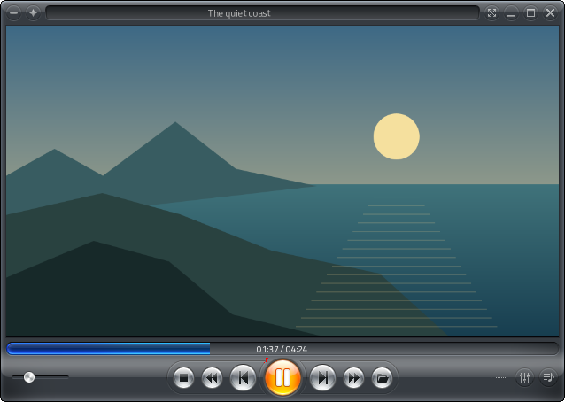
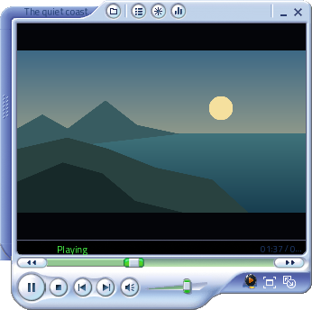
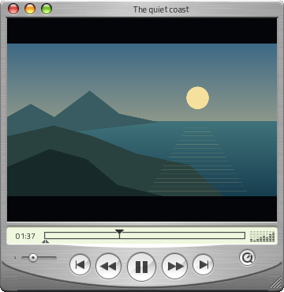
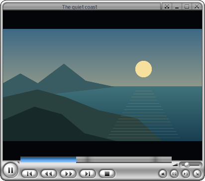
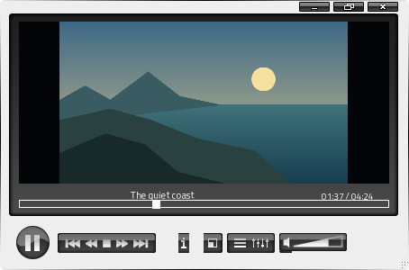
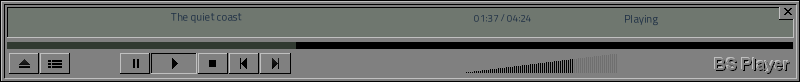
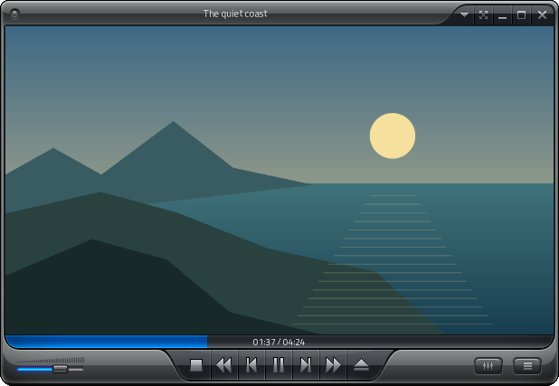
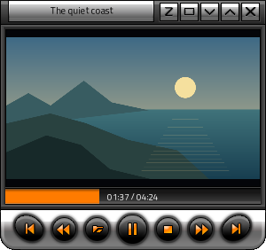
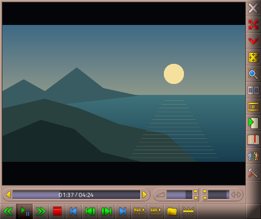

# media-player-video


A Go desktop video player built with the same approach as
[`media-player-music`](../media-player-music): app-owned skins, one shared
playback model, a local playlist and saved sessions, using
[`uitoolkit v0.23.4`](https://github.com/codemodify/uitoolkit/tree/v0.23.4).
Video and synchronized audio play inside the player window through libmpv.

Zoom Player **Onyx** is the first-run default. The retro interfaces use
original skin artwork in frameless, shaped windows, with each player's own
control arrangement. QuickTime uses the original **iFix** skin from your
reference.



| Skin | CLI ID | Original design |
| --- | --- | --- |
| Zoom Player · Onyx | `zoom-player` | Dark chassis, blue timeline, orange transport |
| Zoom Player · Silverchrome | `zoom-player-silver` | Silver chassis and circular controls |
| Zoom Player · Fusion | `zoom-player-fusion` | Original Fusion 8.1.5 chassis and blue timeline |
| Zoom Player · GTZ HD | `zoom-player-gtz-hd` | Silver frame, round orange controls, mini playlist |
| Zoom Player · Brownish | `zoom-player-brownish` | Brown frame, right-hand toolbar and green transport |
| Windows Media Player · 9 Series | `series-9` | Blue/silver Corona chassis and sliding playlist |
| BS.Player · Base | `bsplayer` | Original separate controller and movie window |
| PowerDVD · 5 Glow | `powerdvd` | Original shaped silver/blue controller |
| VLC · Original Default Skin | `vlc` | Original Skins2 default bundled in VLC 0.8.6 |
| QuickTime · iFix | `quicktime` | Brushed metal, traffic lights, separate playlist |
| Default | `default` | Ordinary toolkit window and controls |

| Windows Media Player | QuickTime |
| --- | --- |
|  |  |
| Zoom Silverchrome | VLC Skins2 |
|  |  |




| Zoom Fusion | Zoom GTZ HD |
| --- | --- |
|  |  |



The screenshots use invented filenames and a code-drawn landscape fixture.
Interactive playback displays decoded video, including subtitles.
[Skin sources, credits, and adaptation details](docs/skins.md).

## Build and run

Use Go 1.22.2 or later and a C compiler for the interactive build. Install a
libmpv shared library; it is loaded at runtime and is not bundled. mpv headers
are included with their original ISC notices, so building does not require a
libmpv development package.

On Debian/Ubuntu, the toolkit's native build needs the following packages,
alongside the libmpv runtime provided by your distribution (`libmpv2` on
distributions with the current ABI):

```bash
sudo apt install build-essential pkg-config libx11-dev libxext-dev \
  libxrandr-dev libxfixes-dev libxrender-dev libxi-dev libwayland-dev \
  libxkbcommon-dev libdrm-dev libegl-dev libgles-dev libmpv2
```

On macOS,
`brew install mpv` provides libmpv; build with Xcode command line tools. On
Windows, use a CGO-capable Go/C toolchain and an mpv build providing
`mpv-2.dll` or `libmpv-2.dll`, including its dependent DLLs, alongside the app
or on the DLL search path. Linux embedded playback is tested; macOS and
Windows runtime playback need platform validation.

```bash
go build .
./media-player-video
./media-player-video movie.mp4 another-video.mkv
./media-player-video /path/to/video-folder
./media-player-video -skin zoom-player-silver movie.webm
./media-player-video -skin powerdvd
./media-player-video -scale 1.75
./media-player-video -mpv-library /path/to/libmpv.so.2
./media-player-video -no-session movie.mp4
```

`VIDEO_PLAYER_MPV_LIBRARY` can also select a library path. Discovery checks
the system library loader, Homebrew locations on macOS and the executable's
directory on Windows. A missing library appears in the status line when Play
is attempted; the UI and headless previews remain usable.

Screenshots need no media library or installed player:

```bash
go run . -skin zoom-player -shot /tmp/video-player-shots -at 1m37s
go run . -skin zoom-player-silver -scale 1.75 -shot /tmp/video-player-shots
```

`CGO_ENABLED=0` builds the UI and screenshot path with an explanatory error
for interactive playback. It does not provide a video decoder.

## Using the player

Right click to choose **File → Open video**, or use **Ctrl+O**, to open a local video, or add files/folders to the
playlist. Drop local files or folders onto the player to append them. Folder
scans run off the UI thread, recurse in sorted order and recognize common
video containers. Explicit files are passed to libmpv, whose installed build
determines codec support.

A single playlist click selects a row; double-click or Enter starts it.
Previous/Next, Play/Pause, Stop, seek, volume, mute, shuffle and three repeat
modes use the same decoder across every appearance. A skin change keeps the
current video, clock, volume, speed and track selection. Queue errors and
decoder failures appear in the status readout, tooltip, and application log.

**Audio** selects an audio track. **Subtitles** selects a track, loads an
external SRT/ASS/SSA/VTT/SUB file, or hides subtitles. A subtitle file dropped
onto a playing video is loaded directly. libmpv also searches for matching
subtitle sidecars. **Playback** offers speed presets; **Video** offers
original aspect ratio, crop-to-fill, stretch and fullscreen. Double-click the
video display to enter or leave fullscreen. Drag anywhere in the video area
to move the window. Fullscreen displays video only; keyboard shortcuts and the right-click menu
remain available.

| Shortcut | Action |
| --- | --- |
| `Ctrl+O` / `Ctrl+Shift+O` | Open / append a video |
| `Space` | Play / pause |
| `S` | Stop |
| `P` / `N` | Previous / next video |
| `Left` / `Right` | Seek backward / forward 10 seconds when the video has focus |
| `Up` / `Down` | Volume ±5% when the video has focus |
| `M` | Mute / unmute |
| `[` / `]` | Playback speed ±0.25× |
| `F` / `F11` | Toggle fullscreen |
| `Escape` | Leave fullscreen |
| `Ctrl+L` | Toggle playlist |
| `Ctrl+K` | Cycle appearances |
| `Ctrl+Q` | Quit |

Sessions are saved as `media-player-video/session.json` under the operating
system's user configuration directory. The queue, current file, position,
skin, size, playlist visibility, volume, speed and repeat/shuffle state
survive restarts. Restore begins stopped; press Play to resume. Missing files
are omitted. Closing the player hides it to the system tray while playback
continues. The original skin close button, desktop Close and Alt+F4 all use
this behavior; closing a separate playlist only hides that playlist.

The supplied artwork is saved as [`logo.png`](logo.png) and embedded in the
binary. It supplies the window, taskbar/application-switcher and system-tray
icons, and appears in the empty video display, independent of the chosen skin.
Click the tray icon or choose **Show player** to bring the window forward;
**Quit** or **Ctrl+Q** exits and releases the decoder. The controller and any
open playlist return with the player. When the desktop has no displayed tray
icon, Close exits; if its tray host disappears while hidden, the player
returns to the desktop.

## Architecture and validation

`internal/player` owns the model, actions, queue, sessions and UI.
`internal/appicon` embeds the logo and prepares its native icon sizes.
`internal/skins` owns original skin sources, imported atlases, and layouts.
`tools/import_skins.py` rebuilds the imported packs using Pillow.
`internal/playback` owns the dynamically loaded libmpv client and software
render API. The toolkit supplies widgets, rendering, input, focus,
accessibility and native windows. See [architecture](docs/architecture.md)
and [toolkit integration notes](uitoolkit-gaps.md).

Embedded output uses the CPU render API, capped at 1280 × 720 per frame and
scaled into the window. Source decoding can exceed that resolution. This
initial implementation prioritizes portable embedding and shared skin
controls; a GPU video surface is the next performance improvement.

```bash
go test ./...
go test -race ./...
go vet ./...
```

When ffmpeg and libmpv are available, integration tests generate temporary
videos and verify decoded frames, duration, tracks, subtitles, pause, seek,
volume, speed, mute, EOF, replacement identity and missing-file errors. UI tests
exercise state preservation, queue actions, drops, session restoration and
all appearances at 1× and 1.75×. A live X11 smoke run also verified embedded
playback at desktop scale and clean shutdown. No video test assets are committed.
